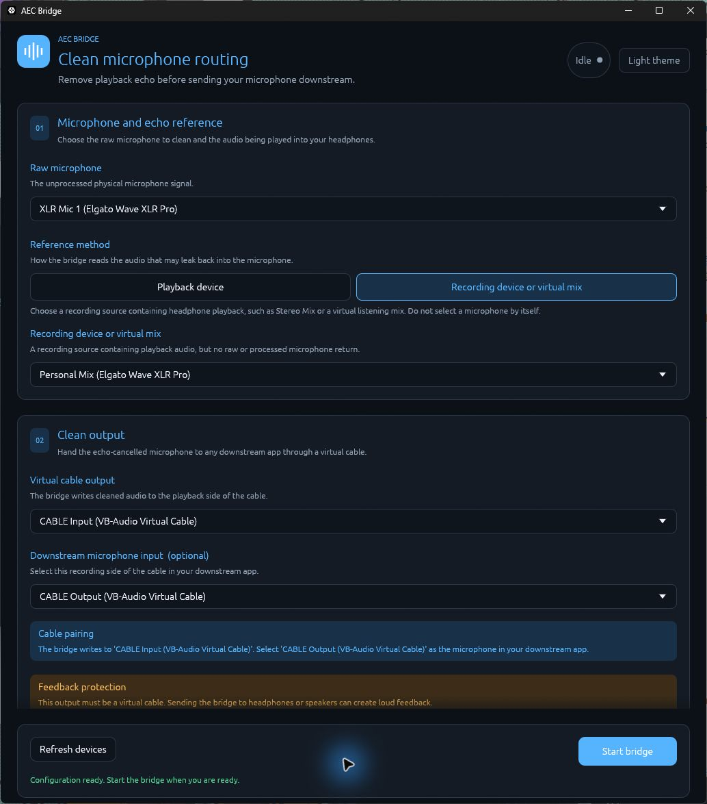

# AEC Bridge

[](https://github.com/nVitius/windows-aec-bridge/actions/workflows/ci.yml)
[](LICENSE)

AEC Bridge is an experimental Windows user-mode acoustic echo cancellation utility. It captures a
raw microphone, obtains a far-end reference from playback loopback or an existing recording
endpoint, runs WebRTC AEC3, and sends the cleaned microphone to an existing virtual audio cable.



The application does not create or install an audio device. A signed virtual cable driver must
already be installed.

## Download

Download the current portable Windows x64 ZIP and its `.sha256` file from the
[Releases page](https://github.com/nVitius/windows-aec-bridge/releases/latest). Extract the ZIP, keep its
contents together, and open `aec-bridge.exe`. There is no installer, and AEC Bridge does not
install a driver.

The release executables are not currently code-signed, so Microsoft Defender SmartScreen may show
an unfamiliar-app warning. You can compare the downloaded ZIP with its published SHA-256 checksum:

```powershell
$zip = Get-ChildItem .\aec-bridge-*-windows-x64.zip | Select-Object -First 1
Get-FileHash $zip -Algorithm SHA256
Get-Content "$($zip.FullName).sha256"
```

To remove the portable app, first turn off **Open AEC Bridge when I sign in to Windows** inside the
app, quit it, and then delete the extracted folder.

## Signal path

```text
Playback output or listening mix ---- reference ----+
                                                    |
Raw microphone -------------------------------> AEC Bridge
                                                    |
                                                    v
                                      virtual cable playback side
                                                    |
                                                    v
                                       paired cable recording side
                                                    |
                                                    v
                                            downstream application
```

Reference audio is analysis-only. It is used to recognize echo and is never mixed into the cleaned
microphone output.

## Included applications

- `aec-bridge.exe` is the graphical application. It uses the Windows GUI subsystem and does not
  open a console window.
- `aec-bridge-cli.exe` provides command-line endpoint listing, configuration checks, and live bridge
  operation.

Both executables use the same audio engine and validation rules.

## Requirements

- Windows x64.
- A separately installed virtual audio cable.
- 48 kHz float32 shared-mode endpoints.
- Capture endpoints must expose one or two channels. Playback-loopback and virtual-handoff
  endpoints must be stereo.

Configure both sides of the virtual cable for 48 kHz. Disable Windows "Listen to this device" and
audio enhancements on the cable, and avoid extremely small cable buffers that cause glitches.

## GUI quick start

1. Open `aec-bridge.exe` directly.
2. Select the unprocessed physical microphone.
3. Choose a reference method:
   - **Playback device** captures an ordinary Windows headphones or speaker endpoint through WASAPI
     loopback.
   - **Recording device or virtual mix** uses an existing recording endpoint carrying the audio
     heard through your headphones, such as Stereo Mix or an application-provided listening mix.
     A microphone by itself is not a useful echo reference.
4. Select the virtual cable's playback side under **Virtual cable output**. With VB-CABLE this is
   commonly named `CABLE Input`.
5. Optionally select the paired recording side under **Downstream microphone input**. With VB-CABLE
   this is commonly named `CABLE Output`.
6. Confirm that the handoff is a virtual cable, then select **Start bridge**.
7. Select the paired cable recording endpoint as the microphone in the downstream application.

When using a recording/virtual-mix reference, include the playback audio you actually hear but
exclude the raw microphone, the virtual-cable return, and any processed microphone return.

The GUI remembers endpoint IDs, last known names, theme, reference mode, delay settings, startup
choices, notification-area preference, and close-button behavior. If an audio-driver update changes
an endpoint ID, the selection is shown as missing rather than silently substituting another device.

## Windows startup

The **Windows startup** card provides four independent settings:

- **Open AEC Bridge when I sign in to Windows** registers the current GUI executable for the current
  Windows account. It does not require administrator privileges and can also be managed in Windows
  Startup Apps. Windows may disable the registered entry there without removing it, so the app can
  report its registration but cannot guarantee that Windows has not overridden it.
- **Hide AEC Bridge in the notification area when minimized** makes the title-bar minimize button
  remove the window from the taskbar. Click the AEC Bridge icon near the clock or choose **Open AEC
  Bridge** from its menu to restore the window. **Quit AEC Bridge** exits normally.
- **When closing the window** controls the title-bar Close button. It can ask each time, minimize to
  the notification area while audio processing continues, or exit AEC Bridge. The first-close prompt
  can remember either action with **Don't ask me again**; return to this setting to change it later.
- **Start the bridge when saved audio devices are ready** opts into unattended bridge startup. It
  becomes available only after the route is configured and the selected handoff is explicitly
  approved as a virtual cable.

Windows starts the application after user sign-in, not as a system service. When automatic bridge
startup is enabled, AEC Bridge starts in the notification area when that preference is enabled, or
minimized on the taskbar otherwise. It looks up the exact saved endpoint IDs and retries device
discovery and transient stream startup with backoff for up to 90 seconds. It never substitutes
default or similarly named devices. If the route is invalid, automatic startup cannot complete
within 90 seconds, or a running bridge later fails while hidden, the window is restored with
diagnostic details.

The startup entry contains the executable's absolute path. If this portable application is moved,
open it from the new location and use **Repair startup entry**. Only one GUI instance can run in a
Windows session.

## Privacy

Audio is processed locally and is not recorded or sent over the network. AEC Bridge has no
telemetry or update checker. Its saved endpoint choices and UI preferences remain in the current
Windows account's application settings.

## Diagnostics console

Open **Diagnostics console** inside the GUI to inspect a bounded rolling log of device discovery,
stream startup, AEC metrics, stop summaries, and failures. The command field accepts these built-in
commands:

```text
help      Show the command list
list      List active capture and playback endpoints
check     Validate the current GUI configuration
status    Show bridge state and selected route
refresh   Rescan Windows audio endpoints
start     Start using the current validated GUI configuration
stop      Stop the running bridge
clear     Clear the rolling log
```

This is an application command console, not a system shell. It does not execute PowerShell, Command
Prompt, programs, scripts, or arbitrary operating-system commands. The log retains at most 500
lines and can be copied to the clipboard.

## Advanced processing

- **Microphone capture delay** briefly holds microphone samples so the playback reference can reach
  AEC first. Start at 20 ms; if echo remains, test 10, 30, and 40 ms one at a time.
- **AEC stream delay** supplies an explicit device/render delay estimate. Zero leaves AEC3's initial
  estimate at zero while it adapts.
- **Bypass echo cancellation** preserves the complete route without AEC processing.
- **Mute virtual handoff** runs the complete pipeline while rendering silence for a safe routing
  test.

## Command-line utility

Endpoint selectors accept a stable WASAPI ID, exact friendly name, or unique name substring.

```powershell
# Show active endpoints, formats, and stable IDs
.\aec-bridge-cli.exe list

# Resolve and validate a route without opening audio streams
.\aec-bridge-cli.exe check `
  --mic "Raw Microphone" `
  --reference "Headphones" `
  --reference-mode loopback `
  --handoff-render "CABLE Input"

# Run until Ctrl+C
.\aec-bridge-cli.exe run `
  --mic "Raw Microphone" `
  --reference "Headphones" `
  --reference-mode loopback `
  --handoff-render "CABLE Input"
```

Additional `run` options:

```text
--capture-delay-ms <0..250>  Hold microphone audio before processing (default: 20)
--stream-delay-ms <0..500>   Delay estimate supplied to AEC3 (default: 0)
--reference-mode <MODE>      `loopback` playback reference or `capture` mix endpoint
--bypass                     Disable echo cancellation without changing the route
--mute-output                Force rendered samples to silence
--duration-seconds <N>       Stop automatically; zero runs until Ctrl+C
```

## Build from source

```powershell
cargo test --all-targets --locked
cargo build --release --locked --bin aec-bridge --bin aec-bridge-cli
```

The pinned and minimum supported toolchain is Rust 1.98.0. To create the same portable ZIP and
checksum produced by CI:

```powershell
.\scripts\package-release.ps1
```

If `Cargo.lock` changes, regenerate the reviewable third-party license bundle before packaging:

```powershell
.\scripts\generate-third-party-licenses.ps1
```

Pull requests and pushes to `main` run formatting, Clippy, tests, a release build, and packaging on
Windows. They also reproduce the license bundle with a checksum-pinned `cargo-about` binary and
fail if it has drifted. Each CI run retains its portable package for 14 days. Pushing a tag that
exactly matches the package version, such as `v0.1.0`, creates a permanent GitHub Release with
generated notes, the ZIP, and its SHA-256 checksum.

## Prototype limitations

- Only 48 kHz float32 shared-mode endpoints are accepted.
- Endpoint removal or an audio-driver restart requires stopping, refreshing, and restarting the
  bridge.
- Level meters and automatic virtual-cable pairing are not included yet.
- Windows has no supported ordinary user-mode API for publishing app-owned PCM as a system-wide
  selectable microphone, so a separately installed virtual-audio driver remains required.
